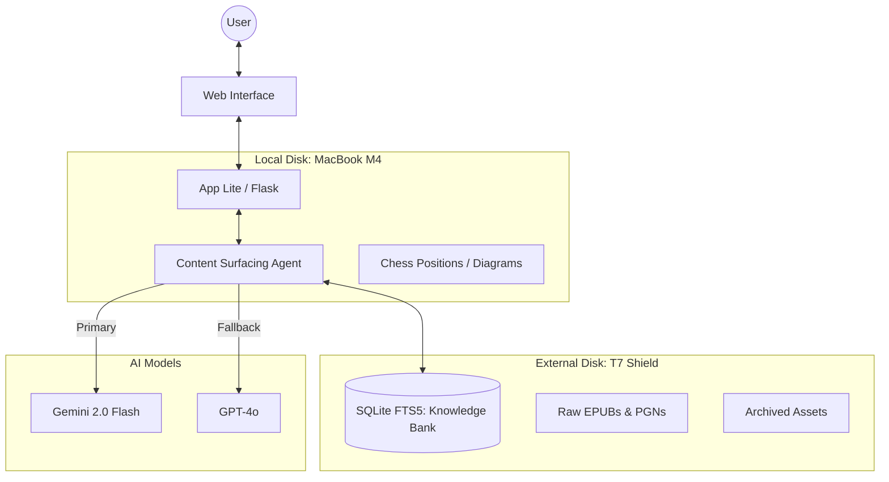

# System Architecture

## Overview
The system follows a **Modular RAG (Retrieval-Augmented Generation)** architecture, split between high-performance local execution and high-capacity external storage.

## Component Breakdown

### 1. The Knowledge Bank (External)
- **Schema**: `knowledge_docs` table in SQLite.
- **Search**: FTS5 virtual table for full-text search.
- **Deduplication**: Content fingerprinting (ignoring PGN move variations) to ensure unique results.

### 2. The Surfacing Agent (Local)
- **Retrieval**: Multi-stage FTS5 search (Phrase -> AND -> OR).
- **Synthesis**: Multi-provider logic.
- **Resilience**: If Gemini hits a `RESOURCE_EXHAUSTED` (429) error, the agent automatically retries with GPT-4o.

### 3. Diagram Engine (Local)
- **Extraction**: Regex-based FEN and Move sequence detection.
- **Rendering**: `chess.svg` and interactive JS boards.

## Database Schema
Wait for `docs/DATABASE_SCHEMA.md` in Phase 2 for details.
